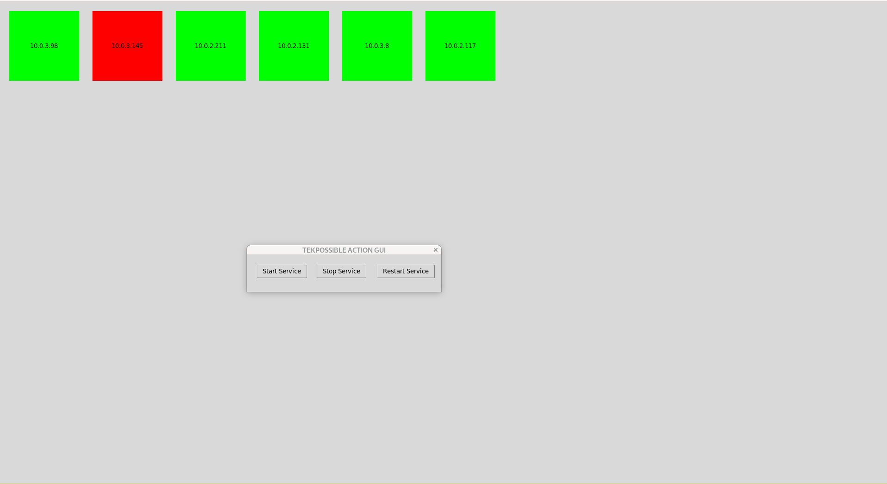

# Status Panel For AWS EC2 Hosts - Lambda /API GW Review
This was made to ensure I completely understood how to use lambda functions in VPCs, as well as API GW. It was also done to ensure that I could deploy these resources via the CDK, as that is my favorite IaC tool.
Below is a screenshot of the service panel:

There are 3 service states: Healthy (Green), Stopped (Grey), and Unhealthy (Red). Below is a picture depicting an example state on my panel. The status panel is updated using API GW in the backend.
The API GW then triggers a lambda function which queries all the registered host's health/actions API. The host side is written in Flask. The hosts are registered by adding their IP into a JSON formatted SSM parameter, which the Lambda and EC2 instances have access to. 

The GUI itself can start, stop, or restart the services on the registered cluster. The GUI also uses an SSM parameter to identify the API GW URL. The GUI is written Python and uses Tkinter as its display library. 

TODO: Add cert based authentication to the API GW and the client side requests. This is to protect the API gateway usage from an attacker.

